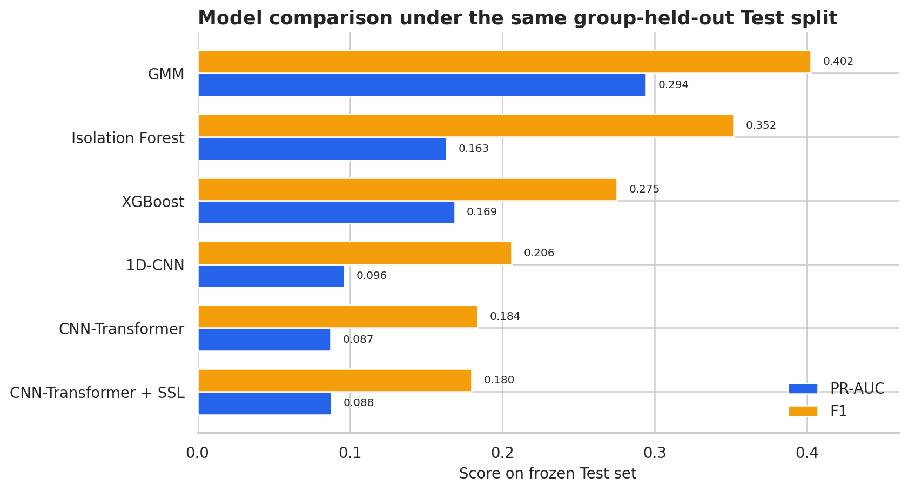
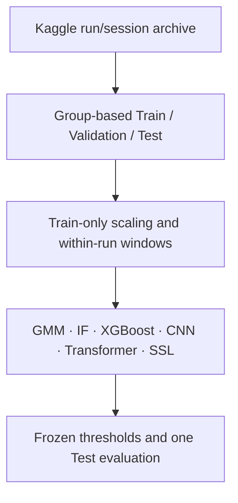
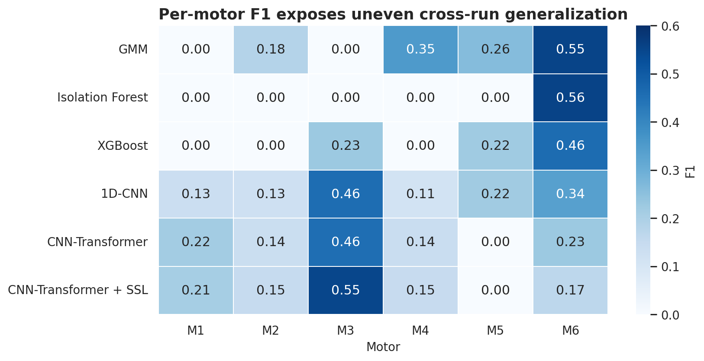
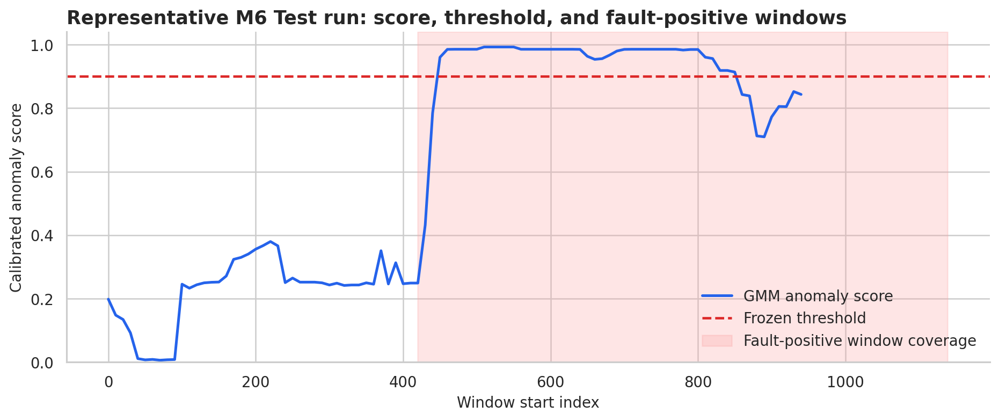

# Leakage-Free Multi-Motor Fault Detection

[](https://www.python.org/)
[](#verification)
[](LICENSE)
[](docs/reproducibility.md)

A reproducible benchmark for six-motor, 18-channel time-series fault detection. The project compares handcrafted density models, supervised machine learning, raw-sequence CNNs, a CNN-Transformer, and contrastive self-supervised pretraining under a strict run-level Train/Validation/Test protocol.

> **Main finding:** the simplest selected density model generalized best. On the frozen Test split, GMM achieved PR-AUC **0.294**, F1 **0.402**, and event-level F1 **0.429**. Transformer and SSL improvements observed during development did not transfer to Test.

**中文简介：**本项目针对6电机18通道时序数据，按独立运行片段构建无泄漏Train/Validation/Test流程，统一比较GMM、Isolation Forest、XGBoost、1D-CNN、CNN-Transformer和自监督对比学习。最终独立测试显示GMM最稳健，复杂深度模型存在明显跨工况泛化与误报问题。



## Why this project

The original course experiment reported high Accuracy under severe class imbalance and likely reused related sliding windows across preprocessing, selection, and evaluation. This upgrade treats experimental design as the primary engineering problem:

- one robot run/session is the unit of independence;
- no sliding window crosses a run or split boundary;
- raw-signal and handcrafted-feature scalers are fitted on Train only;
- Validation owns model selection, early stopping, and thresholds;
- Test is evaluated once after every checkpoint and threshold is frozen;
- PR-AUC, F1, Recall, Precision, per-motor, run-level, and event-level metrics replace Accuracy as the main evidence;
- no point adjustment is used.

## System design



Each 200-point window contains 18 channels: `position`, `temperature`, and `voltage` for Motors 1–6. The model returns six motor-specific fault scores.

The dataset is the Kaggle competition [Robot predictive maintenance – Season 2024](https://www.kaggle.com/competitions/robot-predictive-maintenance-season-2024). Its labeled portion contains 23 independent runs and 39,309 aligned time points. Competition data is not redistributed here.

## Frozen Test results

All rows below use the same 531 windows from eight independent Test runs and the same Validation-frozen threshold policy.

| Model | PR-AUC | Precision | Recall | F1 |
|---|---:|---:|---:|---:|
| **GMM** | **0.294** | **0.342** | 0.488 | **0.402** |
| Isolation Forest | 0.163 | 0.285 | 0.460 | 0.352 |
| XGBoost | 0.169 | 0.170 | 0.712 | 0.275 |
| 1D-CNN | 0.096 | 0.118 | **0.818** | 0.206 |
| CNN + Transformer | 0.087 | 0.119 | 0.404 | 0.184 |
| CNN + Transformer + SSL | 0.088 | 0.113 | 0.439 | 0.180 |

The 1D-CNN maximizes Recall but generates 1,744 false-positive motor-window decisions. GMM provides the strongest precision/recall balance. Run-bootstrap uncertainty remains wide, so the result is intentionally stated as “best on this frozen split,” not as a universal architecture claim.



Motors 1–5 each have fault-positive Test windows from only one independent run; M6 has four positive Test runs. Per-motor numbers are therefore useful failure cases, not high-confidence population estimates.



The shaded region indicates fault-positive overlapping-window coverage. The score and threshold are unchanged from the frozen evaluation.

Detailed aggregate tables are versioned in [`results/`](results/). The full interpretation, event matching definition, ablations, and limitations are in [`docs/final_results.md`](docs/final_results.md).

## Planned ablations and observed outcomes

| Comparison | Test ΔPR-AUC | Test ΔRecall | Test ΔF1 | Interpretation |
|---|---:|---:|---:|---|
| GMM handcrafted vs 1D-CNN raw sequence | −0.198 | +0.330 | −0.196 | Pragmatic but model-confounded representation comparison |
| CNN → CNN + Transformer | −0.009 | −0.414 | −0.022 | Added temporal attention did not transfer |
| Transformer → Transformer + SSL | +0.000 | +0.035 | −0.004 | SSL slightly increased Recall but reduced F1 |

SSL pretraining uses unlabeled Train windows with jitter, scaling, and time masking. The overlap-aware NT-Xent implementation prevents highly overlapping windows from the same run from being treated as negatives. Three fixed seeds improved M6 Validation metrics, but the benefit did not generalize to Test.

## Quick start: frozen GMM inference

Python 3.10+ is supported. The compact, repository-owned GMM bundle is included; raw data is not.

```bash
cd motor-fault-detection
python -m pip install -e .
```

After downloading the Kaggle archive and accepting its rules:

```bash
motor-fault-predict \
  --archive /path/to/robot-predictive-maintenance-season-2024.zip \
  --run-id 20240527_094865 \
  --archive-split testing \
  --output-dir predictions
```

Outputs:

- `<run_id>_window_predictions.csv`: six scores, frozen thresholds, and alarm flags for each window;
- `<run_id>_summary.json`: alarm count, alarm ratio, maximum score, and first alarm index per motor.

The Kaggle `testing_data` labels are blank, so this command is an inference demo, not an additional metric evaluation. The bundled `joblib` checkpoint is trusted repository data; never load an untrusted pickle/joblib file.

## Reproduce the development pipeline

Install optional model dependencies:

```bash
python -m pip install -e ".[deep,viz]"
```

Then run the gated stages:

```bash
python scripts/audit_data.py --archive /path/to/archive.zip
python scripts/build_manifests.py --archive /path/to/archive.zip
python scripts/check_pipeline.py --archive /path/to/archive.zip
python scripts/run_phase2_baselines.py --archive /path/to/archive.zip
python scripts/run_phase3_cnn.py --archive /path/to/archive.zip
python scripts/run_phase4_transformer.py --archive /path/to/archive.zip
python scripts/run_phase5_ssl.py --archive /path/to/archive.zip
```

The Phase 6 evaluator checks frozen hashes, disallows training and Test threshold selection, records its status, and refuses a second completed evaluation. Read [`docs/reproducibility.md`](docs/reproducibility.md) before reproducing the final stage.

## Repository structure

```text
configs/                 frozen data, model, SSL, and Test protocols
src/motor_fault/         data, models, evaluation, SSL, training, inference CLI
src/.../resources/gmm/   compact frozen GMM inference bundle
scripts/                 audit, train, evaluate, export, and verification entry points
tests/                   leakage, metric, model, SSL, event, and inference tests
results/                 compact aggregate results from the frozen Test
docs/                    protocol, model card, final analysis, and README figures
artifacts/               generated locally; excluded from Git
```

## Verification

```bash
make test
```

The public suite contains 23 unit tests covering split leakage, Train-only scaling, window labels, class weights, model shapes, SSL augmentation, overlap-aware negatives, event matching, and inference feature contracts. GitHub Actions runs the suite on Python 3.10 and 3.12.

Internal final-result checks additionally verify that saved scores exactly reproduce every metric and that all six thresholds are byte-for-byte identical to their Validation checkpoints.

## Limitations

- Labeled independent fault runs are scarce; M1–M5 cannot have positive-run support in all three splits.
- Activity and fault type remain partly confounded.
- Sliding windows overlap heavily; non-overlapping and event-level results are diagnostics, not substitutes for more independent runs.
- The handcrafted-versus-raw comparison changes both representation and model family.
- Raw-vs-Z-score-cleaned, CNN autoencoder, explicit cross-variable attention, and calibrated probabilities were not included.
- No Transformer/SSL improvement claim is supported by the frozen Test.

## Documentation

- [Reproducibility and Test integrity](docs/reproducibility.md)
- [Frozen Test analysis](docs/final_results.md)
- [GMM inference model card](docs/model_card.md)
- [Upgrade roadmap](docs/roadmap.md)

## License and data

Project code is released under the [MIT License](LICENSE). The Kaggle competition data and its usage terms remain governed by Kaggle and the competition host; this repository does not redistribute the dataset.
